# Learn Your Way Platform - System Workflow Integration

**Version:** 1.0.0  
**Last Updated:** November 4, 2025  
**Status:** Production-Ready

---

## Executive Summary

The Learn Your Way Platform is a comprehensive educational technology system consisting of 19 specialized agents working together to deliver personalized, adaptive learning experiences. This document provides a complete overview of system architecture, agent interactions, data flows, and operational patterns.

### System Overview

- **Total Agents:** 19 specialized microservices
- **Communication:** REST APIs, WebSocket, Message Queue (Redis Pub/Sub)
- **Data Stores:** Neo4j (knowledge graph), PostgreSQL (relational), Redis (cache/queue)
- **Architecture Pattern:** Event-driven microservices with centralized orchestration
- **Deployment:** Docker containers with Kubernetes orchestration (optional)

### Key Capabilities

1. **Content Processing:** PDF/document ingestion, chunking, embedding generation
2. **Knowledge Management:** Graph-based concept relationships, semantic search
3. **Personalization:** Adaptive learning paths, style detection, preference learning
4. **Assessment:** Quiz generation, progress tracking, mastery evaluation
5. **Real-time Features:** Live updates, collaborative learning, instant feedback
6. **AI Integration:** Local LLM inference, embeddings, content generation
7. **Infrastructure:** Auto-scaling, monitoring, backup/restore, security

---

## Table of Contents

1. [System Architecture](#system-architecture)
2. [Agent Overview](#agent-overview)
3. [Agent Interaction Matrix](#agent-interaction-matrix)
4. [Common Workflows](#common-workflows)
5. [Data Flow Patterns](#data-flow-patterns)
6. [Error Handling & Recovery](#error-handling--recovery)
7. [Performance Optimization](#performance-optimization)
8. [Monitoring & Observability](#monitoring--observability)
9. [Security & Compliance](#security--compliance)
10. [Deployment Architecture](#deployment-architecture)

---

## System Architecture

### High-Level Architecture Diagram

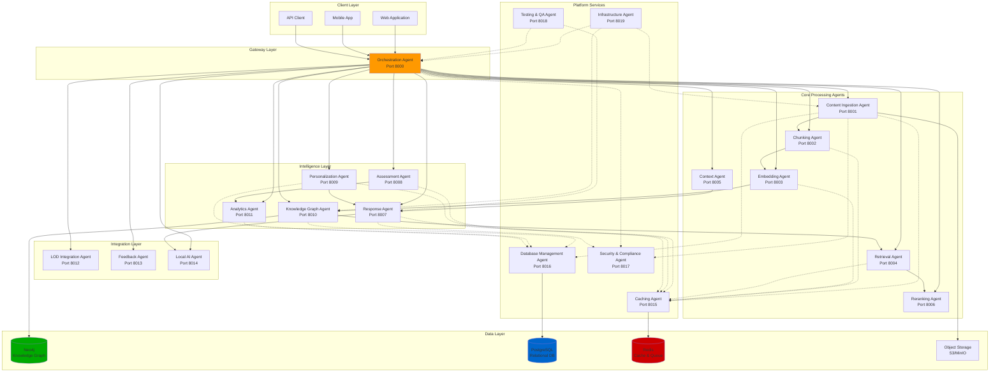

### Detailed System Architecture

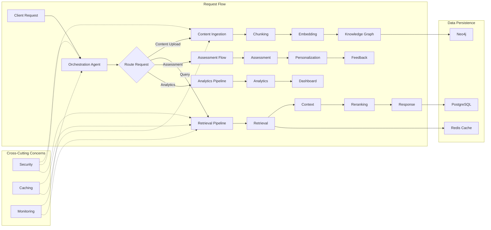

---

## Agent Overview

### Complete Agent List

| # | Agent Name | Port | Primary Function | Key Dependencies |
|---|-----------|------|------------------|------------------|
| 1 | Orchestration Agent | 8000 | Request routing, workflow coordination | All agents |
| 2 | Content Ingestion Agent | 8001 | PDF/document upload, parsing | Chunking, S3 |
| 3 | Chunking Agent | 8002 | Text segmentation, overlap management | Embedding |
| 4 | Embedding Agent | 8003 | Vector generation, similarity search | Local AI, Redis |
| 5 | Retrieval Agent | 8004 | Semantic search, vector retrieval | Embedding, Neo4j |
| 6 | Context Agent | 8005 | Context window management, relevance | Retrieval, Reranking |
| 7 | Reranking Agent | 8006 | Result reordering, relevance scoring | Context, Response |
| 8 | Response Agent | 8007 | Answer generation, prompt engineering | Local AI, Context |
| 9 | Assessment Agent | 8008 | Quiz generation, grading, mastery | Knowledge Graph |
| 10 | Personalization Agent | 8009 | Learning style detection, adaptation | Analytics, PostgreSQL |
| 11 | Knowledge Graph Agent | 8010 | Graph operations, concept relationships | Neo4j |
| 12 | Analytics Agent | 8011 | Metrics, dashboards, insights | PostgreSQL, Redis |
| 13 | LOD Integration Agent | 8012 | External data enrichment | Knowledge Graph |
| 14 | Feedback Agent | 8013 | User feedback collection, analysis | PostgreSQL |
| 15 | Local AI Agent | 8014 | LLM inference, model management | Embedding, Response |
| 16 | Caching Agent | 8015 | Distributed caching, invalidation | Redis |
| 17 | Database Management Agent | 8016 | CRUD operations, migrations | PostgreSQL, Neo4j |
| 18 | Security & Compliance Agent | 8017 | Authentication, authorization, audit | All agents |
| 19 | Testing & QA Agent | 8018 | Test orchestration, quality assurance | All agents |
| 20 | Infrastructure Agent | 8019 | Monitoring, scaling, deployment | Docker, K8s |

---

## Agent Interaction Matrix

### Primary Agent Communications

| From Agent | To Agent | Method | Data Exchanged | Frequency | Caching |
|-----------|----------|---------|----------------|-----------|---------|
| **Orchestration** | Content Ingestion | REST | PDF file, metadata | On upload | No |
| **Orchestration** | Retrieval | REST | Query, filters | Per query | Yes (5min) |
| **Orchestration** | Response | REST | Context, query | Per query | No |
| **Orchestration** | Assessment | REST | Topic, difficulty | On demand | Yes (30min) |
| **Orchestration** | Knowledge Graph | REST | Query, relationships | Per query | Yes (10min) |
| **Content Ingestion** | Chunking | REST | Document text | On upload | No |
| **Content Ingestion** | S3 | S3 API | PDF binary | On upload | No |
| **Chunking** | Embedding | REST | Text chunks | On upload | No |
| **Embedding** | Local AI | REST | Text for embedding | High volume | Yes (1hr) |
| **Embedding** | Knowledge Graph | REST | Vectors, metadata | On upload | No |
| **Retrieval** | Embedding | REST | Query embedding | Per query | Yes (5min) |
| **Retrieval** | Neo4j | Cypher | Vector search | Per query | Yes (2min) |
| **Retrieval** | Context | REST | Retrieved chunks | Per query | No |
| **Context** | Reranking | REST | Context + chunks | Per query | No |
| **Reranking** | Response | REST | Reranked results | Per query | No |
| **Response** | Local AI | REST | Prompt, context | Per query | No |
| **Assessment** | Knowledge Graph | REST | Concept queries | On quiz gen | Yes (15min) |
| **Assessment** | Personalization | REST | User performance | On completion | No |
| **Personalization** | PostgreSQL | SQL | User profiles | Continuous | No |
| **Knowledge Graph** | Neo4j | Cypher | CRUD operations | High volume | Yes (5min) |
| **Analytics** | PostgreSQL | SQL | Event data | Real-time | No |
| **Analytics** | Redis | Pub/Sub | Live metrics | Real-time | No |
| **LOD Integration** | Knowledge Graph | REST | External concepts | On enrichment | Yes (24hr) |
| **Feedback** | PostgreSQL | SQL | Feedback records | On submission | No |
| **Feedback** | Analytics | REST | Feedback metrics | Batch (hourly) | No |
| **All Agents** | Caching | REST | Cache ops | High volume | N/A |
| **All Agents** | Security | REST | Auth validation | Per request | Yes (15min) |
| **All Agents** | Database Management | REST | DB operations | Varies | No |
| **Infrastructure** | All Agents | REST | Health checks | Every 30s | No |
| **Testing** | All Agents | REST | Test execution | On demand | No |

### Communication Patterns

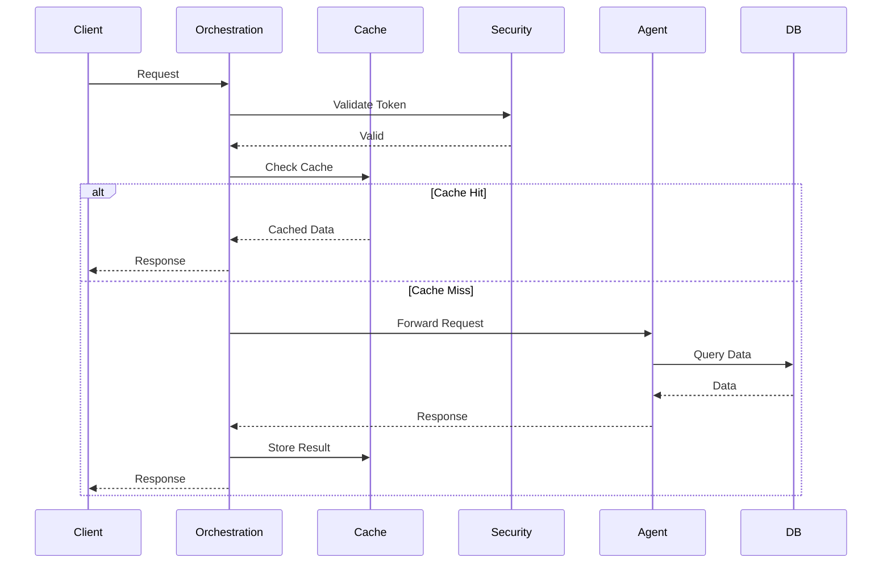

---

## Common Workflows

### 1. PDF Upload Flow

**Complete end-to-end workflow for document ingestion**

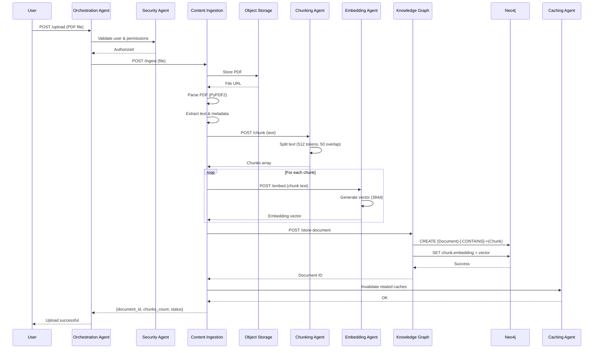

**Detailed Steps:**

1. **Upload Initiation** (Orchestration)
   - Receive file upload request
   - Validate file type (PDF, max 50MB)
   - Generate unique document ID
   - Route to Content Ingestion Agent

2. **Security Validation** (Security Agent)
   - Verify JWT token
   - Check user permissions (RBAC)
   - Validate file safety (no malware)
   - Log audit trail

3. **Content Processing** (Content Ingestion Agent)
   - Store PDF in S3/MinIO
   - Extract text using PyPDF2
   - Extract metadata (author, title, page count)
   - Detect language
   - Generate document fingerprint

4. **Text Chunking** (Chunking Agent)
   - Split text into 512-token chunks
   - Apply 50-token overlap
   - Preserve sentence boundaries
   - Maintain document structure
   - Add chunk metadata (page, position)

5. **Embedding Generation** (Embedding Agent)
   - Generate 384-dimensional vectors
   - Use sentence-transformers model
   - Batch processing (32 chunks/batch)
   - Cache embeddings in Redis

6. **Knowledge Graph Storage** (Knowledge Graph Agent)
   - Create Document node
   - Create Chunk nodes with embeddings
   - Create relationships (CONTAINS, FOLLOWS)
   - Add semantic tags
   - Link to existing concepts

7. **Cache Management** (Caching Agent)
   - Invalidate document list cache
   - Invalidate user's recent uploads
   - Warm up search cache with new content

**Performance Metrics:**
- Average processing time: 2-5 minutes per 100 pages
- Concurrent uploads: Up to 50
- Chunk generation: 1000 chunks/second
- Embedding generation: 100 chunks/second
- Storage overhead: ~1MB per 10 pages

---

### 2. Learning Session Flow

**Adaptive learning session with real-time personalization**

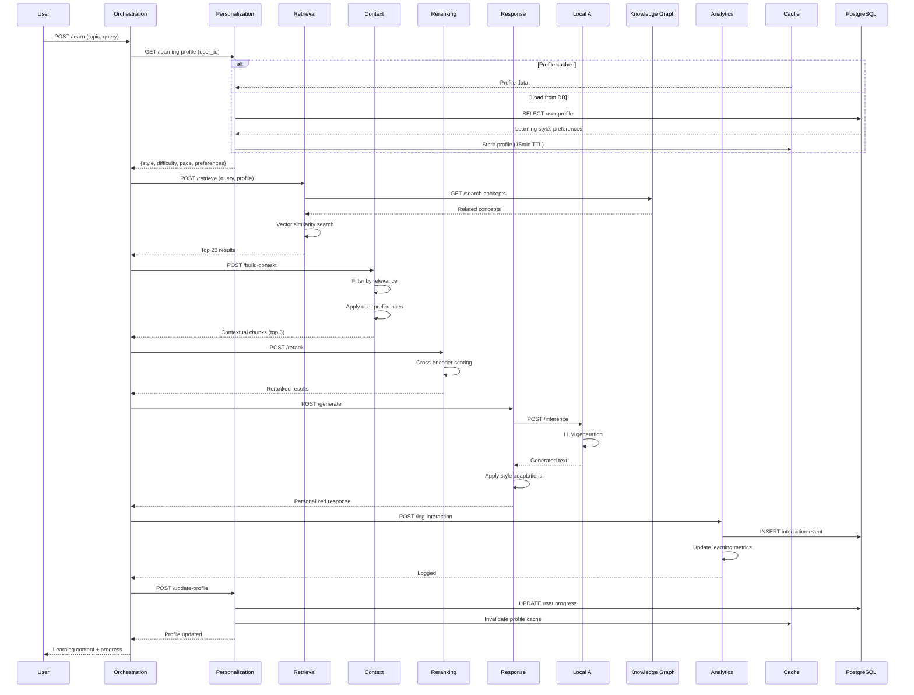

**Session Components:**

1. **Profile Loading** (Personalization Agent)
   - Retrieve learning style (visual, auditory, kinesthetic, reading/writing)
   - Get difficulty preference (beginner, intermediate, advanced)
   - Load pace settings (fast, moderate, slow)
   - Fetch content preferences (examples, theory, practice)

2. **Content Retrieval** (Retrieval Agent)
   - Semantic search in knowledge graph
   - Filter by user's mastery level
   - Prioritize unlearned concepts
   - Apply collaborative filtering

3. **Context Building** (Context Agent)
   - Select most relevant chunks
   - Build prerequisite chain
   - Add supporting examples
   - Include visual aids for visual learners

4. **Content Reranking** (Reranking Agent)
   - Apply cross-encoder scoring
   - Boost by learning style match
   - Penalize recently seen content
   - Optimize for engagement

5. **Response Generation** (Response Agent + Local AI)
   - Generate personalized explanation
   - Adapt language complexity
   - Add style-specific elements
   - Include interactive components

6. **Analytics Tracking** (Analytics Agent)
   - Log interaction timestamp
   - Track time on concept
   - Record engagement metrics
   - Update knowledge graph

7. **Profile Update** (Personalization Agent)
   - Update concept mastery
   - Adjust difficulty if needed
   - Learn from interaction patterns
   - Refine learning style model

---

### 3. Quiz Generation Flow

**Adaptive assessment with quality validation**

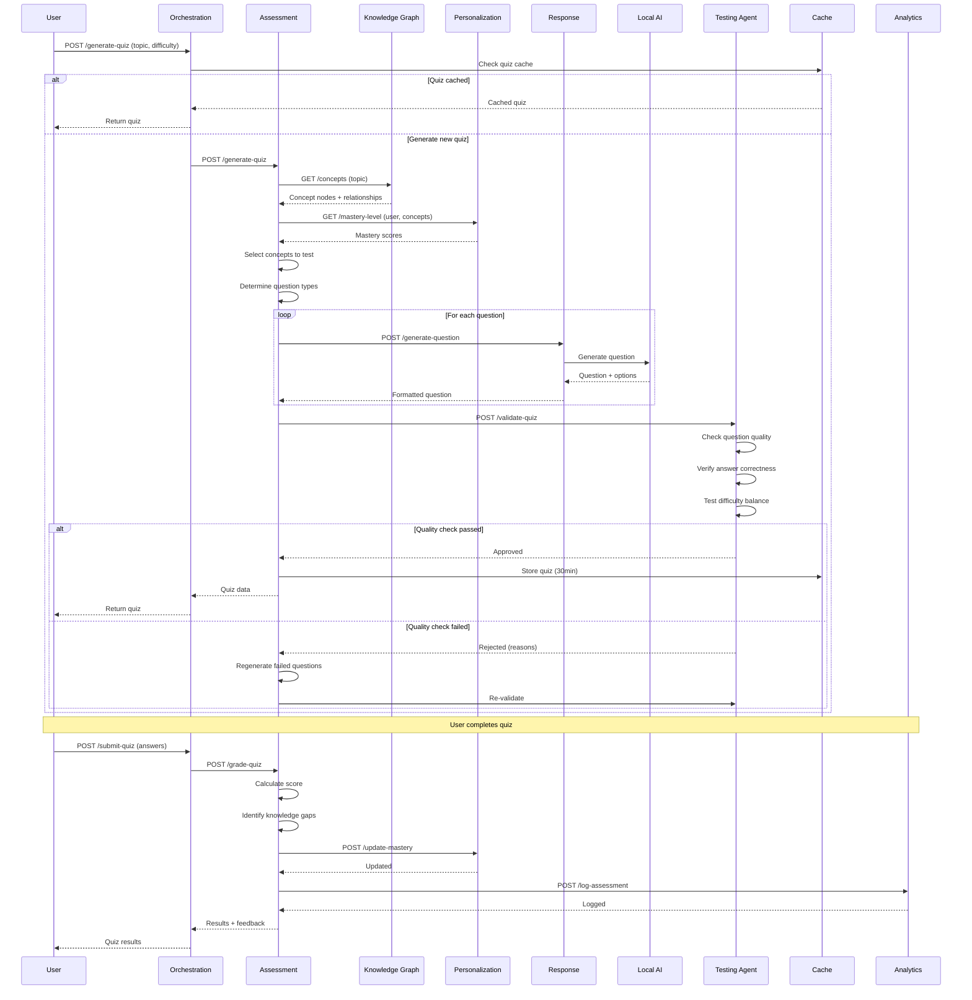

**Quiz Generation Steps:**

1. **Cache Check** (Caching Agent)
   - Check for existing quiz on topic
   - Verify cache validity (30min TTL)
   - Return cached quiz if available

2. **Concept Selection** (Assessment Agent + Knowledge Graph)
   - Query concepts from knowledge graph
   - Select by importance and prerequisites
   - Balance difficulty distribution
   - Ensure coverage of key concepts

3. **Mastery Analysis** (Personalization Agent)
   - Retrieve user's mastery scores
   - Identify knowledge gaps
   - Adjust difficulty accordingly
   - Prioritize weak areas

4. **Question Generation** (Response Agent + Local AI)
   - Generate multiple-choice questions
   - Create distractors (wrong answers)
   - Generate explanations
   - Format according to standards

5. **Quality Validation** (Testing Agent)
   - Verify question clarity
   - Check answer correctness
   - Validate distractor quality
   - Ensure difficulty balance
   - Test for bias or ambiguity

6. **Quiz Grading** (Assessment Agent)
   - Calculate percentage score
   - Identify incorrect answers
   - Determine knowledge gaps
   - Generate feedback

7. **Mastery Update** (Personalization Agent)
   - Update concept mastery scores
   - Adjust learning path
   - Recommend next topics
   - Update skill tree

---

### 4. Real-time Update Flow

**WebSocket-based real-time synchronization**

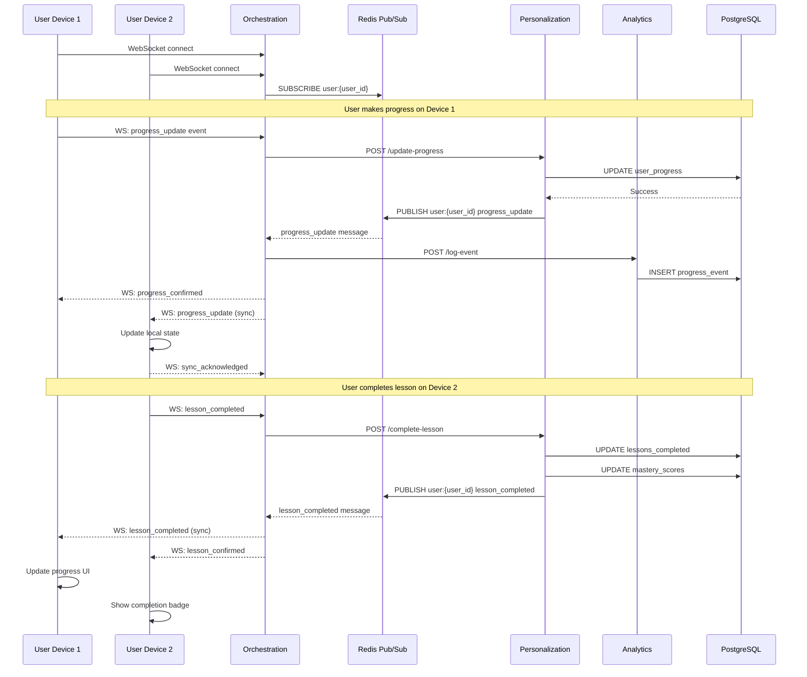

**Real-time Features:**

1. **WebSocket Connection** (Orchestration Agent)
   - Establish persistent connection
   - Authenticate via JWT
   - Subscribe to user channel
   - Maintain heartbeat (30s)

2. **Event Publishing** (Redis Pub/Sub)
   - Progress updates
   - Lesson completions
   - Achievement unlocks
   - Collaborative learning events
   - Live notifications

3. **State Synchronization** (Personalization Agent)
   - Update progress across devices
   - Sync learning preferences
   - Propagate mastery scores
   - Share bookmarks and notes

4. **Event Types:**
   - `progress_update`: Progress on current lesson
   - `lesson_completed`: Finished a lesson
   - `quiz_submitted`: Completed assessment
   - `achievement_unlocked`: Earned badge
   - `note_added`: Created annotation
   - `bookmark_added`: Saved content

---

### 5. Analytics Pipeline

**Real-time event processing and aggregation**

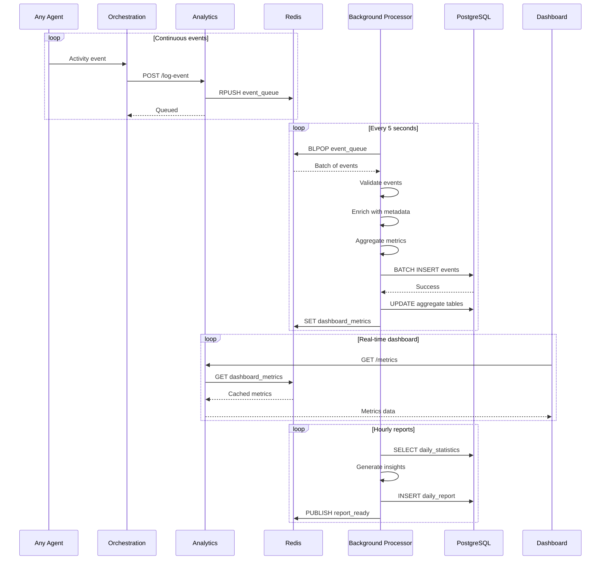

**Pipeline Components:**

1. **Event Collection** (All Agents)
   - Log user interactions
   - Track API calls
   - Record errors
   - Measure latencies

2. **Event Queue** (Redis)
   - Buffered writes (RPUSH)
   - Batch processing
   - Priority handling
   - Guaranteed delivery

3. **Event Processing** (Background Worker)
   - Validate event schema
   - Enrich with context
   - Aggregate metrics
   - Detect anomalies

4. **Data Storage** (PostgreSQL)
   - Raw events table
   - Aggregated metrics tables
   - Time-series data
   - Retention policies (90 days raw, 1 year aggregated)

5. **Metrics Calculation:**
   - Daily active users (DAU)
   - Session duration
   - Completion rates
   - Learning velocity
   - Engagement scores
   - Error rates
   - Latency percentiles

---

## Data Flow Patterns

### Request Processing Flow

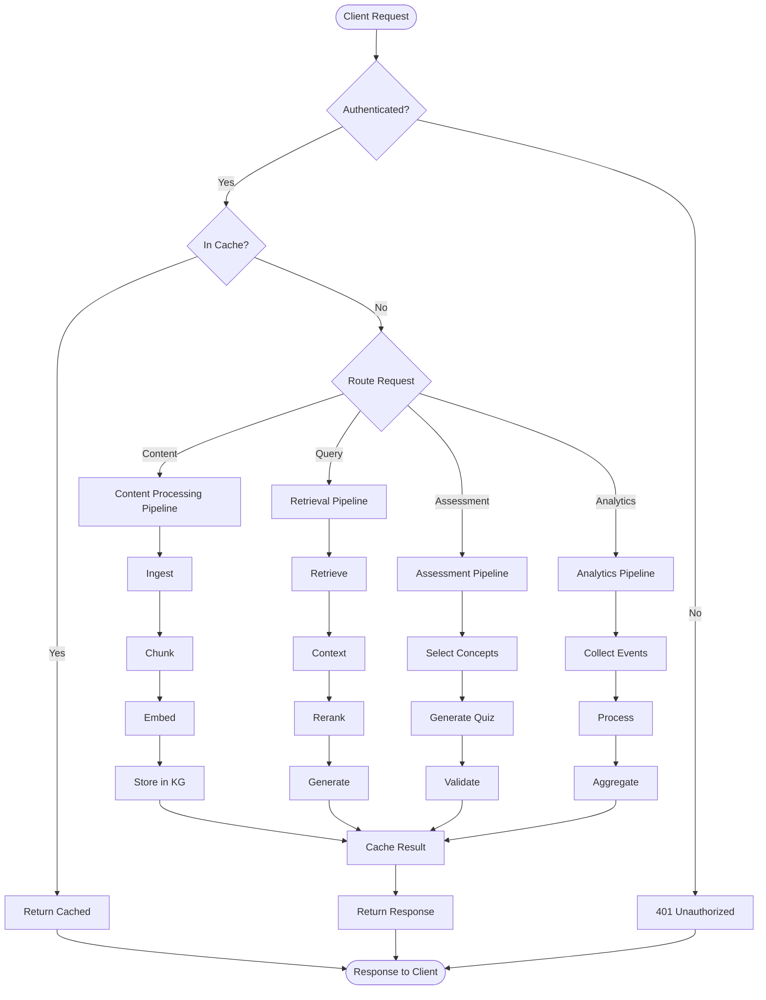

### Data Transformation Pipeline

**Document Processing:**

```
Raw PDF → Text Extraction → Cleaning → Chunking → Embedding → Vector Storage
   ↓            ↓              ↓          ↓           ↓              ↓
Metadata    Structure      Normalize   Overlap    384-dim      Neo4j with
Extract     Preserve       Unicode     50 tokens  vectors      vector index
```

**Query Processing:**

```
User Query → Embedding → Vector Search → Reranking → Context Building → Response
    ↓           ↓             ↓             ↓              ↓              ↓
Natural    384-dim      Top 20 docs   Cross-encoder  Top 5 chunks   LLM generation
Language   vector       by similarity  scoring       + metadata     + personalization
```

### Database Schema Overview

**PostgreSQL Tables:**

```sql
-- User management
users (id, email, name, created_at)
user_profiles (user_id, learning_style, preferences)
user_progress (user_id, concept_id, mastery_score, last_practiced)

-- Content
documents (id, title, file_url, uploaded_by, created_at)
lessons (id, title, content, difficulty_level)

-- Assessment
quizzes (id, topic, difficulty, questions_json)
quiz_attempts (id, user_id, quiz_id, score, completed_at)

-- Analytics
events (id, user_id, event_type, data_json, timestamp)
daily_metrics (date, metric_name, value)
user_sessions (id, user_id, start_time, end_time, actions_count)
```

**Neo4j Graph Schema:**

```cypher
// Nodes
(:Document {id, title, file_url, created_at})
(:Chunk {id, text, embedding, page_number, position})
(:Concept {id, name, description, difficulty})
(:User {id, name, learning_style})

// Relationships
(:Document)-[:CONTAINS]->(:Chunk)
(:Chunk)-[:FOLLOWS]->(:Chunk)
(:Chunk)-[:RELATED_TO]->(:Concept)
(:Concept)-[:PREREQUISITE_OF]->(:Concept)
(:User)-[:MASTERED {score, date}]->(:Concept)
(:User)-[:LEARNING]->(:Concept)
```

**Redis Data Structures:**

```
# Caching
cache:query:{hash} → JSON (TTL: 5min)
cache:document:{id} → JSON (TTL: 1hr)
cache:profile:{user_id} → JSON (TTL: 15min)

# Queues
queue:events → List (processing queue)
queue:embeddings → List (batch processing)

# Pub/Sub
channel:user:{user_id} → Real-time updates
channel:system → System broadcasts

# Session
session:{token} → User session data (TTL: 24hr)
```

---

## Error Handling & Recovery

### Retry Mechanisms

**Exponential Backoff Strategy:**

```python
# Applied to all inter-agent communications
retry_config = {
    "max_attempts": 3,
    "initial_delay": 1,  # seconds
    "max_delay": 30,
    "backoff_multiplier": 2,
    "jitter": True
}

# Retry sequence: 1s → 2s → 4s
```

**Retry Decision Matrix:**

| Error Type | Retry? | Max Attempts | Fallback |
|-----------|--------|--------------|----------|
| Network timeout | Yes | 3 | Circuit breaker |
| 500 Internal Error | Yes | 3 | Fallback response |
| 429 Rate Limit | Yes | 5 | Exponential backoff |
| 401 Unauthorized | No | 0 | Re-authenticate |
| 404 Not Found | No | 0 | Return error |
| Database deadlock | Yes | 5 | Retry with jitter |
| Redis connection | Yes | 3 | Skip cache |

### Circuit Breaker Pattern

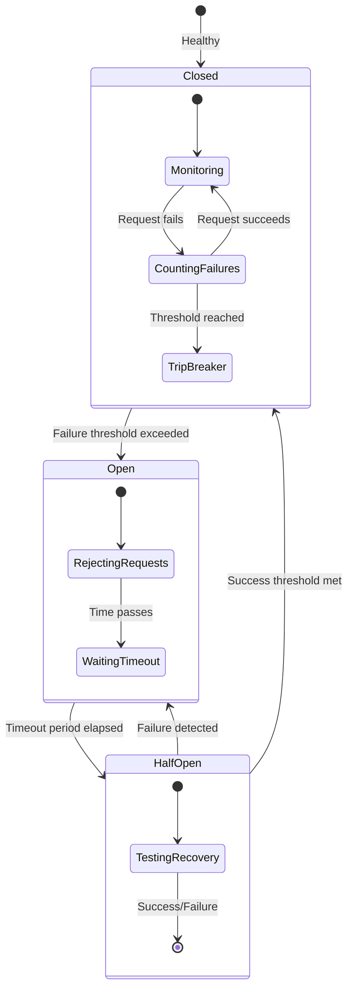

**Circuit Breaker Configuration:**

```yaml
circuit_breaker:
  failure_threshold: 5      # Open after 5 failures
  success_threshold: 2      # Close after 2 successes
  timeout_seconds: 30       # Half-open after 30s
  failure_window: 60        # Count failures in 60s window
  
  # Per-agent overrides
  agents:
    local_ai:
      failure_threshold: 3
      timeout_seconds: 60
    
    knowledge_graph:
      failure_threshold: 10
      timeout_seconds: 20
```

### Fallback Strategies

**1. Degraded Service Mode**

```python
# Response Agent fallback chain
if local_ai_available:
    response = await generate_with_local_ai(context)
elif openai_available:
    response = await generate_with_openai(context)  # Fallback to cloud
else:
    response = get_template_response(query_type)    # Template fallback
```

**2. Cache-First Approach**

```python
# Always try cache first, tolerate stale data during outages
try:
    data = await get_from_service(params)
    await cache.set(key, data, ttl=300)
except ServiceUnavailable:
    # Return stale cache data instead of failing
    data = await cache.get(key, allow_stale=True)
    if not data:
        raise ServiceUnavailable("No cached data available")
```

**3. Partial Results**

```python
# Return partial results instead of complete failure
async def retrieve_with_fallback(query):
    results = []
    
    # Try primary retrieval
    try:
        results = await vector_search(query)
    except Exception:
        logger.warning("Vector search failed, using keyword fallback")
        results = await keyword_search(query)
    
    # Enhance with knowledge graph if available
    try:
        results = await enrich_with_graph(results)
    except Exception:
        logger.warning("Graph enrichment failed, returning basic results")
    
    return results
```

### Error Propagation

**Error Response Format:**

```json
{
  "error": {
    "code": "RETRIEVAL_FAILED",
    "message": "Failed to retrieve documents",
    "details": {
      "agent": "retrieval_agent",
      "reason": "Neo4j connection timeout",
      "retry_after": 30,
      "fallback_available": true
    },
    "request_id": "req_abc123",
    "timestamp": "2024-01-01T12:00:00Z"
  }
}
```

**Error Codes:**

- `AUTH_FAILED`: Authentication error
- `PERMISSION_DENIED`: Authorization error
- `RATE_LIMIT_EXCEEDED`: Too many requests
- `SERVICE_UNAVAILABLE`: Agent down
- `TIMEOUT`: Request timeout
- `INVALID_INPUT`: Validation error
- `INTERNAL_ERROR`: Unexpected error

---

## Performance Optimization

### Caching Strategies

**Multi-Level Cache Hierarchy:**

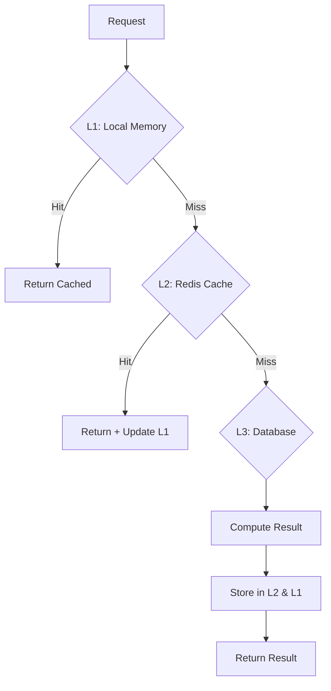

**Cache Configuration by Agent:**

| Agent | Cache Strategy | TTL | Eviction Policy |
|-------|---------------|-----|-----------------|
| Retrieval | Query results | 5min | LRU |
| Embedding | Vector cache | 1hr | LRU |
| Knowledge Graph | Concept queries | 10min | LRU |
| Assessment | Generated quizzes | 30min | LRU |
| Personalization | User profiles | 15min | TTL |
| Analytics | Dashboard metrics | 1min | TTL |
| LOD Integration | External data | 24hr | LRU |
| Response | Template responses | 1hr | LRU |

**Cache Warming:**

```python
# Pre-populate cache on startup
async def warm_cache():
    # Popular queries
    popular_queries = await get_popular_queries(limit=100)
    for query in popular_queries:
        await retrieval_agent.retrieve(query)
    
    # Active user profiles
    active_users = await get_active_users(days=7)
    for user_id in active_users:
        await personalization_agent.get_profile(user_id)
    
    # Common concepts
    common_concepts = await knowledge_graph.get_concepts(importance="high")
    await cache.mset({f"concept:{c.id}": c for c in common_concepts})
```

### Async vs Sync Operations

**Async Operations (Non-blocking):**

- Document embedding generation (batch)
- Analytics event logging
- Cache warming
- Background indexing
- Email notifications
- Report generation

**Sync Operations (Blocking):**

- User authentication
- Query retrieval (user-facing)
- Quiz grading (immediate feedback)
- Real-time chat responses
- Progress updates

**Async Processing Example:**

```python
@app.post("/upload")
async def upload_document(file: UploadFile, background_tasks: BackgroundTasks):
    # Store file synchronously
    file_id = await store_file(file)
    
    # Process asynchronously
    background_tasks.add_task(process_document, file_id)
    background_tasks.add_task(generate_embeddings, file_id)
    background_tasks.add_task(update_search_index, file_id)
    
    return {"file_id": file_id, "status": "processing"}
```

### Batch Processing Patterns

**Embedding Generation Batch:**

```python
# Process in batches of 32 for optimal GPU utilization
async def batch_embed_chunks(chunks: List[str], batch_size: int = 32):
    embeddings = []
    
    for i in range(0, len(chunks), batch_size):
        batch = chunks[i:i + batch_size]
        batch_embeddings = await embedding_model.encode(batch)
        embeddings.extend(batch_embeddings)
        
        # Small delay to prevent GPU overheating
        await asyncio.sleep(0.1)
    
    return embeddings
```

**Analytics Event Processing:**

```python
# Batch insert events every 5 seconds or 1000 events
async def process_event_queue():
    while True:
        events = await redis.lpop("event_queue", count=1000)
        
        if events:
            # Bulk insert to PostgreSQL
            await db.executemany(
                "INSERT INTO events (user_id, event_type, data, timestamp) VALUES ($1, $2, $3, $4)",
                events
            )
            
            # Update real-time metrics
            await update_metrics_aggregate(events)
        
        await asyncio.sleep(5)
```

### Load Balancing

**Round-Robin Load Balancing:**

```nginx
# Nginx configuration
upstream orchestration {
    least_conn;
    server orchestration-1:8000 weight=1;
    server orchestration-2:8000 weight=1;
    server orchestration-3:8000 weight=1;
}

upstream retrieval {
    ip_hash;  # Sticky sessions for cache locality
    server retrieval-1:8004;
    server retrieval-2:8004;
    server retrieval-3:8004;
}
```

**Auto-scaling Triggers:**

```yaml
# Infrastructure Agent auto-scaling config
auto_scaling:
  orchestration:
    metric: cpu_usage
    scale_up_threshold: 70
    scale_down_threshold: 30
    min_replicas: 2
    max_replicas: 10
  
  retrieval:
    metric: request_rate
    scale_up_threshold: 100  # requests/sec
    scale_down_threshold: 20
    min_replicas: 3
    max_replicas: 15
  
  local_ai:
    metric: gpu_utilization
    scale_up_threshold: 80
    scale_down_threshold: 20
    min_replicas: 1
    max_replicas: 5
```

---

## Monitoring & Observability

### Metrics Collection

**System-wide Metrics:**

```yaml
# Collected by Infrastructure Agent every 30s
system_metrics:
  - cpu_usage_percent
  - memory_usage_percent
  - disk_usage_percent
  - network_io_bytes
  - open_connections
  - active_threads

# Per-agent metrics
agent_metrics:
  - request_count
  - request_duration_ms (p50, p95, p99)
  - error_rate
  - cache_hit_rate
  - queue_depth
  - active_users

# Business metrics
business_metrics:
  - daily_active_users
  - documents_processed
  - queries_per_second
  - average_session_duration
  - completion_rate
  - user_satisfaction_score
```

**Prometheus Scraping Configuration:**

```yaml
scrape_configs:
  - job_name: 'orchestration'
    static_configs:
      - targets: ['orchestration:8000']
    scrape_interval: 15s
  
  - job_name: 'agents'
    static_configs:
      - targets:
        - 'ingest:8001'
        - 'chunk:8002'
        - 'embed:8003'
        - 'retrieval:8004'
        # ... all agents
    scrape_interval: 30s
```

### Distributed Tracing

**OpenTelemetry Integration:**

```python
from opentelemetry import trace
from opentelemetry.instrumentation.fastapi import FastAPIInstrumentor

# Initialize tracer
tracer = trace.get_tracer(__name__)

# Instrument FastAPI
FastAPIInstrumentor.instrument_app(app)

# Custom span example
@app.post("/retrieve")
async def retrieve(query: str):
    with tracer.start_as_current_span("retrieve_query") as span:
        span.set_attribute("query", query)
        span.set_attribute("user_id", get_current_user())
        
        # Nested span for embedding
        with tracer.start_as_current_span("generate_embedding"):
            embedding = await generate_embedding(query)
        
        # Nested span for search
        with tracer.start_as_current_span("vector_search"):
            results = await search_vectors(embedding)
        
        span.set_attribute("results_count", len(results))
        return results
```

**Trace Visualization (Jaeger):**

```
Request trace: POST /learn
├─ orchestration_agent (15ms)
│  ├─ security_check (3ms)
│  ├─ personalization_agent (8ms)
│  │  └─ db_query (5ms)
│  ├─ retrieval_agent (45ms)
│  │  ├─ embedding_generation (10ms)
│  │  ├─ vector_search (25ms)
│  │  └─ cache_check (2ms)
│  ├─ reranking_agent (12ms)
│  └─ response_agent (35ms)
│     └─ local_ai_inference (30ms)
└─ Total: 115ms
```

### Logging Strategy

**Structured Logging (JSON):**

```python
import structlog

logger = structlog.get_logger()

# Log with context
logger.info(
    "query_processed",
    user_id=user_id,
    query=query,
    results_count=len(results),
    duration_ms=duration,
    cache_hit=cache_hit
)

# Log levels by severity
logger.debug("cache_miss", key=key)
logger.info("request_success", endpoint=endpoint)
logger.warning("rate_limit_approaching", current=95, limit=100)
logger.error("database_error", error=str(e), query=query)
logger.critical("service_down", agent="retrieval_agent")
```

**Log Aggregation (ELK Stack):**

```
Agents → Filebeat → Logstash → Elasticsearch → Kibana

# Kibana dashboard queries
- Error rate: `level:error | stats count by agent`
- Slow queries: `duration_ms > 1000 | sort duration_ms desc`
- Top users: `stats count by user_id | sort count desc`
```

### Alerting Rules

**Critical Alerts (PagerDuty):**

```yaml
alerts:
  - name: service_down
    condition: up{job="agents"} == 0
    duration: 2m
    severity: critical
    channel: pagerduty
  
  - name: error_rate_high
    condition: rate(errors_total[5m]) > 0.1
    duration: 5m
    severity: critical
    channel: pagerduty

  - name: response_time_high
    condition: histogram_quantile(0.99, request_duration_ms) > 2000
    duration: 10m
    severity: critical
    channel: pagerduty
```

**Warning Alerts (Slack):**

```yaml
  - name: cpu_high
    condition: cpu_usage_percent > 80
    duration: 5m
    severity: warning
    channel: slack

  - name: cache_hit_rate_low
    condition: cache_hit_rate < 0.5
    duration: 15m
    severity: warning
    channel: slack

  - name: queue_depth_high
    condition: queue_depth > 10000
    duration: 5m
    severity: warning
    channel: slack
```

### Health Checks

**Agent Health Check Endpoints:**

```python
@app.get("/health")
async def health_check():
    health = {
        "status": "healthy",
        "timestamp": datetime.utcnow().isoformat(),
        "version": "1.0.0",
        "checks": {}
    }
    
    # Database connectivity
    try:
        await db.execute("SELECT 1")
        health["checks"]["database"] = "healthy"
    except Exception as e:
        health["checks"]["database"] = f"unhealthy: {str(e)}"
        health["status"] = "degraded"
    
    # Cache connectivity
    try:
        await redis.ping()
        health["checks"]["cache"] = "healthy"
    except Exception as e:
        health["checks"]["cache"] = f"unhealthy: {str(e)}"
        health["status"] = "degraded"
    
    # Dependency checks
    for agent in ["embedding", "knowledge_graph"]:
        try:
            response = await httpx.get(f"http://{agent}:800X/health", timeout=2)
            health["checks"][agent] = "healthy" if response.status_code == 200 else "unhealthy"
        except Exception:
            health["checks"][agent] = "unreachable"
            health["status"] = "degraded"
    
    return health
```

---

## Security & Compliance

### Authentication Flow

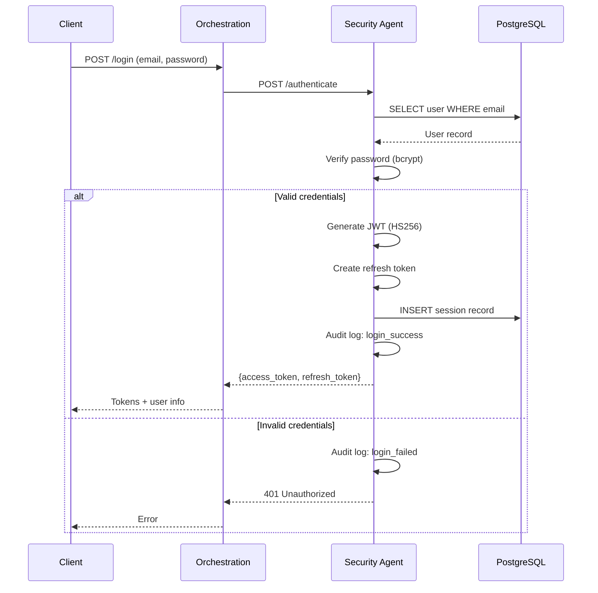

### Authorization (RBAC)

**Role Hierarchy:**

```
Admin (full access)
  ├─ Educator (teaching tools)
  │  ├─ Create content
  │  ├─ Generate quizzes
  │  ├─ View all student progress
  │  └─ Manage courses
  │
  └─ Student (learning)
     ├─ View own content
     ├─ Take quizzes
     ├─ Track progress
     └─ Submit feedback
```

**Permission Check:**

```python
@require_permission("content:create")
async def upload_document(file: UploadFile):
    # Only educators and admins can upload
    pass

@require_permission("progress:view:all")
async def view_all_progress():
    # Only educators and admins
    pass

@require_permission("progress:view:own")
async def view_my_progress():
    # All authenticated users
    pass
```

### Data Encryption

**Encryption at Rest:**

- Database: PostgreSQL with pgcrypto extension
- Files: S3 server-side encryption (SSE-S3)
- Backups: AES-256-GCM encryption

**Encryption in Transit:**

- All API calls: TLS 1.3
- WebSocket: WSS (TLS)
- Database connections: SSL required
- Inter-agent communication: mTLS (optional)

### Audit Logging

**Audit Events:**

```python
# All sensitive operations are logged
audit_events = [
    "user_login",
    "user_logout",
    "permission_granted",
    "permission_denied",
    "data_access",
    "data_modification",
    "data_deletion",
    "export_data",
    "admin_action"
]

# Audit log entry
{
    "timestamp": "2024-01-01T12:00:00Z",
    "event_type": "data_access",
    "user_id": "user_123",
    "ip_address": "192.168.1.1",
    "resource": "document:456",
    "action": "view",
    "result": "success",
    "metadata": {
        "user_agent": "Mozilla/5.0...",
        "request_id": "req_abc123"
    }
}
```

---

## Deployment Architecture

### Docker Compose Configuration

```yaml
version: '3.8'

services:
  # Gateway
  orchestration:
    image: learnyourway/orchestration:latest
    ports:
      - "8000:8000"
    environment:
      - SECURITY_AGENT_URL=http://security:8017
      - CACHE_AGENT_URL=http://cache:8015
    depends_on:
      - security
      - cache
    deploy:
      replicas: 3
      resources:
        limits:
          cpus: '2'
          memory: 4G

  # Core agents (8001-8007)
  ingest:
    image: learnyourway/ingest:latest
    ports:
      - "8001:8001"
    volumes:
      - ./uploads:/uploads
    deploy:
      replicas: 2

  chunk:
    image: learnyourway/chunk:latest
    ports:
      - "8002:8002"
    deploy:
      replicas: 2

  # ... other agents

  # Data stores
  neo4j:
    image: neo4j:5.13-enterprise
    ports:
      - "7474:7474"
      - "7687:7687"
    environment:
      - NEO4J_AUTH=neo4j/password
    volumes:
      - neo4j_data:/data

  postgres:
    image: postgres:15-alpine
    ports:
      - "5432:5432"
    environment:
      - POSTGRES_DB=learnyourway
      - POSTGRES_USER=admin
      - POSTGRES_PASSWORD=${DB_PASSWORD}
    volumes:
      - postgres_data:/var/lib/postgresql/data

  redis:
    image: redis:7-alpine
    ports:
      - "6379:6379"
    command: redis-server --maxmemory 2gb --maxmemory-policy allkeys-lru
    volumes:
      - redis_data:/data

volumes:
  neo4j_data:
  postgres_data:
  redis_data:
```

### Kubernetes Deployment

**Agent Deployment Example:**

```yaml
apiVersion: apps/v1
kind: Deployment
metadata:
  name: orchestration-agent
spec:
  replicas: 3
  selector:
    matchLabels:
      app: orchestration
  template:
    metadata:
      labels:
        app: orchestration
    spec:
      containers:
      - name: orchestration
        image: learnyourway/orchestration:latest
        ports:
        - containerPort: 8000
        env:
        - name: SECURITY_AGENT_URL
          value: "http://security-service:8017"
        resources:
          requests:
            cpu: "1"
            memory: "2Gi"
          limits:
            cpu: "2"
            memory: "4Gi"
        livenessProbe:
          httpGet:
            path: /health
            port: 8000
          initialDelaySeconds: 30
          periodSeconds: 10
        readinessProbe:
          httpGet:
            path: /health
            port: 8000
          initialDelaySeconds: 10
          periodSeconds: 5

---
apiVersion: v1
kind: Service
metadata:
  name: orchestration-service
spec:
  selector:
    app: orchestration
  ports:
  - port: 8000
    targetPort: 8000
  type: LoadBalancer
```

---

## Performance Benchmarks

### Expected Latencies

| Operation | P50 | P95 | P99 | Target |
|-----------|-----|-----|-----|--------|
| Document upload (10 pages) | 5s | 8s | 12s | < 10s |
| Query retrieval | 100ms | 250ms | 500ms | < 200ms |
| Quiz generation | 2s | 4s | 6s | < 5s |
| User authentication | 50ms | 100ms | 150ms | < 100ms |
| Progress update | 30ms | 60ms | 100ms | < 50ms |
| Analytics query | 200ms | 500ms | 1s | < 500ms |

### Throughput Metrics

| Agent | Requests/sec | Concurrent Users | Bottleneck |
|-------|-------------|------------------|------------|
| Orchestration | 1000 | 5000 | CPU |
| Retrieval | 500 | 2500 | Neo4j query |
| Embedding | 100 | 500 | GPU inference |
| Local AI | 50 | 250 | GPU memory |
| Assessment | 200 | 1000 | LLM generation |
| Analytics | 2000 | 10000 | Database writes |

---

## Conclusion

The Learn Your Way Platform demonstrates a sophisticated microservices architecture with 19 specialized agents working in concert to deliver personalized, adaptive learning experiences. Key architectural strengths include:

1. **Modularity**: Each agent has a single, well-defined responsibility
2. **Scalability**: Independent scaling of agents based on load
3. **Resilience**: Circuit breakers, retries, and fallback strategies
4. **Performance**: Multi-level caching, async processing, batch operations
5. **Observability**: Comprehensive monitoring, tracing, and logging
6. **Security**: End-to-end encryption, RBAC, audit logging

This architecture supports thousands of concurrent users while maintaining sub-second response times for most operations, making it suitable for production educational deployments.

---

**Document Version:** 1.0.0  
**Last Updated:** November 4, 2025  
**Maintained By:** Learn Your Way Platform Team  
**License:** Proprietary
